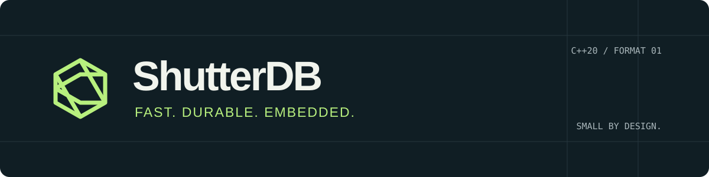

<p align="center"></p>

# ShutterDB

[](https://github.com/ivanimmanuel-dev/ShutterDB/actions/workflows/ci.yml)
[](LICENSE)

**Fast. Durable. Embedded.**

A lightweight embedded key-value database for modern C++. No server, C++20,
checksummed storage, crash-aware recovery, and zero third-party runtime dependencies.

**v0.1.0 is experimental.** Linux GCC/Clang and Windows MSVC pass hosted tests;
macOS passes the functional suite. Keep backups. This is not a production-durability certification.

```cpp
#include <shutter/db.hpp>
#include <iostream>

int main() {
    shutter::DB db("app.shdb");
    db.put("hello", "world");
    if (auto value = db.get_string("hello")) {
        std::cout << *value << '\n';
    }
    db.remove("hello");
}
```

The [validation report](docs/validation.md) records the million-operation workload,
sanitizers, fuzz campaigns, corruption checks and failure recovery. Start with the
[release notes](docs/releases/v0.1.0.md) for the scope and known limitations.

## Small enough to understand

- **Sync by default.** A successful write passes through `fsync` on Linux or `FlushFileBuffers` on Windows.
- **An append-only source of truth.** Keys and file locations live in memory; values stay on disk.
- **Checksums on metadata and data.** CRC32C protects every file header, record header, key and value.
- **Deliberate recovery.** Incomplete final records can be discarded. A checksum failure is an error, including at the end of the file.
- **Compaction with a recovery path.** A checked replacement and durable backup precede replacement of the original.
- **A useful inspection tool.** `verify --json` reports counts, offsets, checksums, incomplete tails and reclaimable bytes without changing database contents.
- **Ordinary CMake.** One public target, four public headers, no download during the default build.

There are no transactions, iterators, SQL, network services, background threads, compression, encryption, or configuration daemon. One process owns an open database. Calls on one `DB` are serialized with a single mutex.

## Build in three commands

Download the [release source](https://github.com/ivanimmanuel-dev/ShutterDB/releases/tag/v0.1.0)
or clone this repository. From its root, with CMake 3.21+ and a C++20 compiler:

```sh
cmake -S . -B build -DCMAKE_BUILD_TYPE=Release
cmake --build build --config Release --parallel
ctest --test-dir build -C Release --output-on-failure
```

The default tests use a vendored, pinned doctest header. Python 3 enables CLI,
corruption and Linux syscall-fault tests; the engine and parser tests do not require Python.
On Visual Studio generators the executable is `build/Release/shutter.exe`; on
single-configuration generators it is `build/shutter`. Install `bin/` on your PATH
or use that executable path in the CLI examples below.

## Use from your project

```sh
cmake --install build --config Release --prefix /your/install/prefix
```

```cmake
find_package(ShutterDB CONFIG REQUIRED)
target_link_libraries(myapp PRIVATE ShutterDB::ShutterDB)
```

Pass `-DCMAKE_PREFIX_PATH=/your/install/prefix` to your project's configure command.
Vendoring and local `FetchContent` also work; see [getting started](docs/getting-started.md).

## Try the CLI

```sh
shutter init app.shdb
shutter set username cosmos --db app.shdb
shutter get username --db app.shdb
shutter delete username --db app.shdb
shutter stats --db app.shdb --json
shutter verify --db app.shdb
shutter compact --db app.shdb
```

Binary values have a first-class path:

```sh
shutter set thumbnail --value-file thumbnail.bin --db app.shdb
shutter get thumbnail --raw --db app.shdb > restored.bin
```

`get --json` returns an explicitly labeled hexadecimal encoding. Missing keys exit 1; usage errors exit 2; I/O errors exit 3; corruption exits 4; lock conflicts exit 5. `--db` defaults to `app.shdb`. Only `init` creates a database. `verify` never repairs it; `recover` explicitly discards a recognized incomplete tail.

For a guided persistence-and-corruption tour on disposable data, run `python tools/demo.py build/shutter` (or the Windows executable path). See the [recorded tour](docs/demo-transcript.txt).

## Choose durability intentionally

```cpp
shutter::Options options;
options.sync_writes = false; // Buffered mode: recent writes may be lost on OS/power failure.
shutter::DB db("cache.shdb", options);
db.put("key", "value");
db.sync();                  // Explicit durability barrier; failures throw.
```

The destructor does not promise a flush. Linux is the reference platform; Windows functional tests do not establish equivalent power-loss semantics. Storage hardware and the filesystem must honor synchronization. Read the [durability contract](docs/durability.md) before trusting important data to a new engine.

## Explore

| Guide | What it answers |
|---|---|
| [Getting started](docs/getting-started.md) | Install, embed, store binary data |
| [Architecture](docs/architecture.md) | Write path, memory budget, locking, compaction |
| [File format](docs/file-format.md) | Every byte of format v1 |
| [Durability](docs/durability.md) | What a successful operation means |
| [Error handling](docs/error-handling.md) | Errors, ambiguous outcomes, verification |
| [Testing and fuzzing](docs/testing.md) | Run crash tests, sanitizers and libFuzzer |
| [Benchmarks](docs/benchmarks.md) | Workloads, real measurements, limitations |
| [Competitive notes](docs/competitive-notes.md) | Why this particular small engine |
| [FAQ](docs/faq.md) · [Roadmap](docs/roadmap.md) | Tradeoffs and deliberately deferred features |

Contributions start with a reproducible case. See [CONTRIBUTING.md](CONTRIBUTING.md), [SECURITY.md](SECURITY.md), and the [release checklist](docs/releasing.md).
