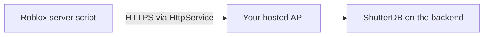

# Using ShutterDB with Roblox

ShutterDB can run on a backend or in development tools used by a Roblox project.
It cannot be loaded as a C++ library inside a Roblox script: Luau's sandbox removes
native module loading and direct filesystem access. [Luau sandbox](https://luau.org/sandbox/)

## External backend

Roblox supports external storage and analytics services through `HttpService`.
Requests must be enabled in the experience settings. The API would validate and
authenticate requests, perform application operations, and keep one ShutterDB handle
open on its own local disk. That API and hosting are separate work; this repository
currently provides the storage library, CLI and local examples.
[Roblox HTTP service](https://create.roblox.com/docs/cloud-services/http-service)

A first integration could cache generated world layouts or derived data used by an
external game dashboard. Development tools can also use ShutterDB directly to retain
generated assets and previews between runs.

For player progress, currency, inventory and purchases, use Roblox DataStores as the
authoritative store. DataStores are designed to persist experience data across servers
and sessions. ShutterDB's bounded cache intentionally evicts records and does not supply
multi-record transactions or server replication.
[Roblox DataStores](https://create.roblox.com/docs/cloud-services/data-stores)

Database microbenchmarks do not predict in-game request latency: an external deployment
adds network travel and API processing. Measure the complete Roblox-to-backend request
before choosing it for a latency-sensitive game operation.

## Studio tools

Studio plugins can communicate with a separately running local program through
`HttpService` and localhost. Such a program could embed ShutterDB for the plugin's
generated data. The plugin itself still does not open the database file.
[Studio plugin HTTP requests](https://create.roblox.com/docs/cloud-services/http-service#use-in-plugins)
